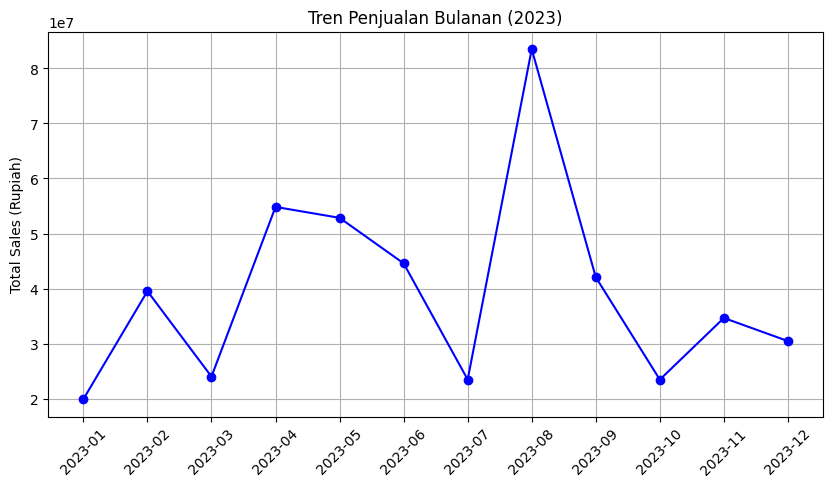
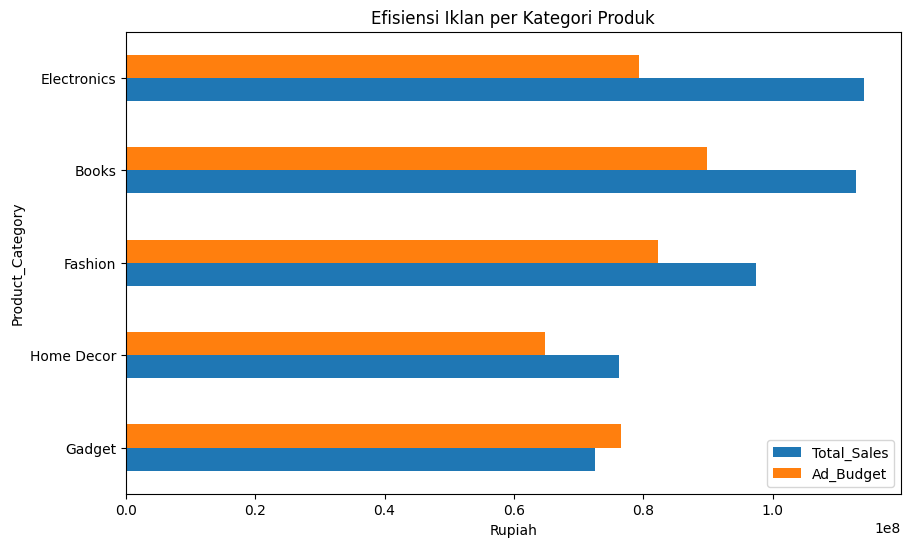
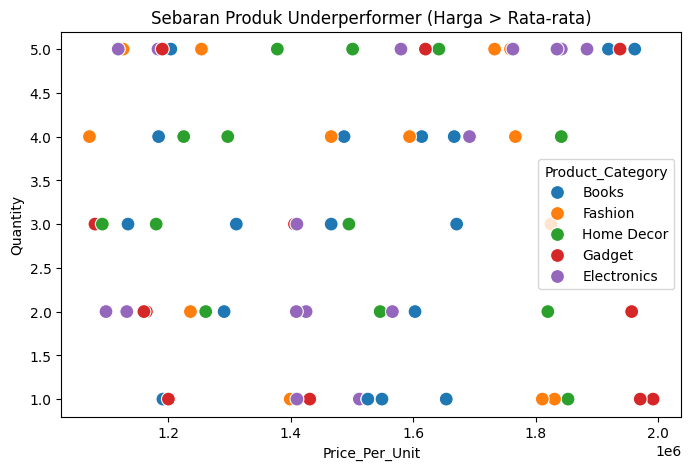
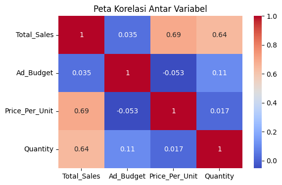

# Laporan Akhir: Analisis Kinerja Penjualan E-commerce

Proyek ini bertujuan untuk mengevaluasi performa penjualan pada sebuah platform e-commerce guna mengetahui pola penjualan, efektivitas pemasaran, serta segmentasi pelanggan. Hasil analisis diharapkan dapat menjadi dasar pengambilan keputusan strategis untuk meningkatkan pendapatan dan efisiensi bisnis.

Anggota Kelompok  
Ahmad Zainur Royyan | XI RPL 8 | 06  
Natanz Meshaal Saptoaji | XI RPL 8 | 26

## 1. Business Question

Analisis dilakukan untuk menjawab beberapa pertanyaan bisnis berikut:

* **Tren Penjualan:** Bagaimana pola perubahan penjualan selama tahun 2023?
* **Efektivitas Iklan:** Seberapa besar pengaruh anggaran iklan terhadap peningkatan penjualan?
* **Kategori Underperformer:** Produk kategori apa yang memiliki nilai ROI (Return on Investment) iklan paling rendah?
* **Segmentasi Pelanggan:** Bagaimana karakteristik pelanggan berdasarkan metode RFM (Recency, Frequency, Monetary)?

## 2. Data Wrangling

Tahapan persiapan dan pembersihan data meliputi:

* **Menangani Missing Value:** Nilai kosong pada kolom `Total_Sales` diisi menggunakan hasil perhitungan `Quantity × Price_Per_Unit`.
* **Perubahan Format Data:** Kolom `Order_Date` diubah ke format *datetime* agar dapat dianalisis berdasarkan waktu.
* **Pengecekan Validitas Data:** Memastikan tidak terdapat nilai tidak wajar, seperti `Price_Per_Unit` bernilai negatif.

## 3. Insight dan Temuan Analisis

### Tren Penjualan

Penjualan mengalami perubahan yang cukup fluktuatif pada setiap bulan sepanjang tahun 2023.

### Efektivitas Iklan dan ROI

* **Korelasi Sangat Lemah:** Hubungan antara `Ad_Budget` dan `Total_Sales` hanya sebesar **0.035**, sehingga menunjukkan pengaruh iklan terhadap penjualan sangat kecil.
* **ROI Tertinggi:** Kategori **Electronics** memiliki performa iklan terbaik dengan ROI sebesar **1.43**.
* **ROI Terendah:** Kategori **Gadget** menjadi kategori dengan performa terendah karena hanya memperoleh ROI sebesar **0.94**.

### Analisis Prediksi

* **Hasil Regresi Linear:** Model Regresi Linear yang digunakan untuk memprediksi penjualan berdasarkan anggaran iklan menghasilkan nilai R-squared sebesar **-0.07**. Hal ini menunjukkan bahwa anggaran iklan belum mampu menjadi faktor prediksi penjualan yang efektif pada dataset ini.

### Distribusi Produk

Kategori Gadget memiliki jumlah transaksi paling tinggi, tetapi kontribusi keuntungannya masih kurang optimal dibandingkan kategori lainnya.

### Heatmap Korelasi

Visualisasi heatmap digunakan untuk melihat hubungan antar variabel pada dataset.

## 4. Dataset dan Segmentasi Pelanggan

### Penjelasan Kolom Dataset

| Kolom            | Keterangan                                          |
| :--------------- | :-------------------------------------------------- |
| Order_ID         | ID unik setiap transaksi                            |
| CustomerID       | ID unik pelanggan                                   |
| Order_Date       | Tanggal transaksi dilakukan                         |
| Product_Category | Jenis kategori produk yang dibeli                   |
| Quantity         | Jumlah produk yang dibeli                           |
| Price_Per_Unit   | Harga per unit produk                               |
| Ad_Budget        | Anggaran iklan yang digunakan                       |
| Total_Sales      | Total nilai penjualan (`Quantity × Price_Per_Unit`) |

### Contoh Hasil Analisis RFM

Berikut contoh hasil segmentasi pelanggan menggunakan metode RFM:

| CustomerID | Recency (Hari) | Frequency (Transaksi) | Monetary (Total Belanja) |
| :--------- | :------------- | :-------------------- | :----------------------- |
| 5001       | 217            | 4                     | Rp8.562.000              |
| 5002       | 81             | 4                     | Rp8.983.000              |
| 5003       | 122            | 3                     | Rp9.433.000              |

## 5. Rekomendasi Strategis

Berdasarkan hasil analisis, berikut beberapa rekomendasi yang dapat diterapkan:

1. **Pengalihan Anggaran Iklan:** Sebagian anggaran iklan dari kategori **Gadget** dapat dialihkan ke kategori **Electronics** karena memberikan ROI yang lebih tinggi.
2. **Program Clearance Sale:** Produk pada kategori **Gadget** disarankan mengikuti program diskon atau *clearance sale* untuk mempercepat perputaran stok.
3. **Pemasaran Berbasis RFM:** Data segmentasi pelanggan dapat dimanfaatkan untuk strategi pemasaran yang lebih personal, seperti pemberian reward kepada pelanggan loyal atau promosi khusus bagi pelanggan yang sudah lama tidak bertransaksi.
4. **Evaluasi Strategi Marketing:** Karena hubungan iklan dan penjualan sangat rendah, perusahaan perlu mempertimbangkan strategi pemasaran lain seperti SEO, media sosial, dan program loyalitas pelanggan.
